<p align="center">
  
  
  
  
</p>

<h1 align="center">🎵 LyricFlow</h1>

<p align="center">
  <strong>One command. One MP3. One stunning lyric video.</strong>
</p>

<p align="center">
  <em>An AI-powered pipeline that transforms any Hindi song into a beautifully animated lyric video — fully automated, zero manual work.</em>
</p>

<br />

<p align="center">
  
  
  
  
</p>

---

## ✨ What It Does

Drop in an MP3 file, and LyricFlow handles **everything**:

```
🎤 MP3 File ───► 🔊 Vocal Isolation ───► 📝 Transcription ───► 🤖 AI Refinement ───► 🎬 Lyric Video
```

| Step | Engine | What Happens |
|:-----|:-------|:-------------|
| **1. Vocal Isolation** | BS-Roformer (Viper-2) | Separates vocals from instrumentals with LUFS normalization & high-pass filtering |
| **2. Transcription** | WhisperX `large-v3` | Word-level timestamps with forced alignment for precise sync |
| **3. AI Refinement** | Google Gemini 2.5 Pro | Corrects lyrics, transliterates Hindi→Latin, groups into poetic lines |
| **4. Video Render** | Remotion (React) | Cinematic lyric video with animations, glow effects & progress bar |

---

## 🚀 Quick Start

### Prerequisites

- **Python 3.10+**
- **Node.js 18+** & npm
- **FFmpeg** installed and available in PATH
- **Google Gemini API Key** ([Get one here](https://aistudio.google.com/apikey))

### 1️⃣ Clone & Install Python Dependencies

```bash
git clone https://github.com/yourusername/lyricflow.git
cd lyricflow

pip install -r requirements.txt
```

### 2️⃣ Install Video Dependencies

```bash
cd video
npm install
cd ..
```

### 3️⃣ Set Up Environment

Create a `.env` file in the project root:

```env
GEMINI_API_KEY=your_gemini_api_key_here
```

### 4️⃣ Run It! 🎉

```bash
python main.py "path/to/your/song.mp3"
```

That's it. Your lyric video will be in `output_song/<song_name>/`.

---

## 📁 Output Structure

```
output_song/
└── your_song/
    ├── lyrics.json     # Timestamped, refined lyrics
    └── your_song.mp4   # The final lyric video (1920×1080)
```

<details>
<summary><b>📋 Example <code>lyrics.json</code></b></summary>

```json
[
  {
    "text": "Subah ki dhoop si naya hai yeh savera",
    "start": 28.84,
    "end": 33.66
  },
  {
    "text": "Peeche chhoot gaya woh raat ka andhera",
    "start": 33.9,
    "end": 38.63
  },
  {
    "text": "Chalo chalein khwabon ke shehar",
    "start": 59.43,
    "end": 62.26
  }
]
```

</details>

---

## 🏗️ Architecture

```mermaid
graph LR
    A["🎵 MP3 Input"] --> B["🔊 audio_utils.py"]
    B -->|"LUFS Norm + BS-Roformer + HPF"| C["🎤 Clean Vocals"]
    C --> D["📝 transcribe_engine.py"]
    D -->|"WhisperX large-v3 + Alignment"| E["📊 Word-Level Timestamps"]
    E --> F["🤖 text_refinery.py"]
    F -->|"Gemini 2.5 Pro"| G["✅ lyrics.json"]
    G --> H["🎬 Remotion Video"]
    A --> H
    H --> I["🎥 Final MP4"]

    style A fill:#FF6B6B,stroke:#333,color:#fff
    style C fill:#4ECDC4,stroke:#333,color:#fff
    style E fill:#45B7D1,stroke:#333,color:#fff
    style G fill:#FFBE0B,stroke:#333,color:#000
    style I fill:#845EF7,stroke:#333,color:#fff
```



---

## 📂 Project Structure

```
lyricflow/
├── main.py                  # 🎯 Orchestrator — runs the full pipeline
├── audio_utils.py           # 🔊 Vocal isolation (BS-Roformer + FFmpeg)
├── transcribe_engine.py     # 📝 WhisperX transcription & alignment
├── text_refinery.py         # 🤖 Gemini lyric refinement
├── requirements.txt         # 📦 Python dependencies
├── .env                     # 🔑 API keys (not committed)
│
├── video/                   # 🎬 Remotion video project
│   ├── src/
│   │   ├── Root.tsx         #    Remotion composition setup
│   │   └── index.ts         #    Entry point
│   ├── public/              #    Auto-populated audio & lyrics
│   ├── package.json
│   └── tsconfig.json
│
├── output_song/             # 📁 Generated outputs per song
├── separated/               # 🎤 Intermediate vocal files
└── models/                  # 🧠 Cached AI models
```

---

## ⚙️ Advanced Usage

### Custom API Key (without `.env`)

```bash
python main.py "song.mp3" --api-key YOUR_API_KEY
```

### Preview Video in Browser

```bash
cd video
npm start
```

Opens the Remotion Studio at `localhost:3000` for real-time preview.

### Render Video Separately

```bash
cd video
npm run render
```

---

## 🧠 How Each Module Works

<details>
<summary><b>🔊 Vocal Isolation — <code>audio_utils.py</code></b></summary>

<br />

Uses a 3-stage audio processing pipeline:

1. **LUFS Normalization** — Normalizes input to −14 LUFS for consistent volume
2. **BS-Roformer Separation** — State-of-the-art model (`model_bs_roformer_ep_317_sdr_12.9755`) isolates vocals from instrumentals
3. **100Hz High-Pass Filter** — Removes sub-bass rumble that confuses transcription models

The model is automatically downloaded from Hugging Face on first run.

</details>

<details>
<summary><b>📝 Transcription — <code>transcribe_engine.py</code></b></summary>

<br />

- Loads the **WhisperX `large-v3`** model for Hindi (`hi`) transcription
- Performs **forced alignment** to get word-level timestamps (not just segment-level)
- Outputs precise `start`/`end` times rounded to 2 decimal places for every word
- Runs on CPU by default for maximum compatibility (GPU supported)

</details>

<details>
<summary><b>🤖 AI Refinement — <code>text_refinery.py</code></b></summary>

<br />

Sends word-level timestamps to **Gemini 2.5 Pro** with instructions to:

- ✅ Group words into natural, poetic lyric lines (6–10 words each)
- ✅ Correct Hindi spelling errors from ASR output
- ✅ Transliterate to Latin script (Hindi → Roman phonetics)
- ✅ Preserve exact timestamps — no interpolation or guessing

Falls back to raw transcription if AI refinement fails.

</details>

<details>
<summary><b>🎬 Video Rendering — <code>video/</code></b></summary>

<br />

Built with **Remotion** (React-based programmatic video):

- 🎨 Cinematic dark gradient background with animated glow
- ✨ Fade-in/out lyric animations with smooth slide transitions
- 📊 Animated progress bar with gradient styling
- 🎵 Synchronized audio playback
- 📐 Full HD output (1920×1080 @ 30fps)

</details>

---

## 📋 Requirements

| Dependency | Purpose |
|:-----------|:--------|
| `audio-separator` | BS-Roformer vocal isolation |
| `whisperx` | Speech-to-text with forced alignment |
| `google-generativeai` | Gemini 2.5 Pro lyric refinement |
| `torch` / `torchaudio` | PyTorch backend for ML models |
| `remotion` | Programmatic video rendering |
| `ffmpeg` | Audio pre/post-processing |

---

## 🤔 FAQ

<details>
<summary><b>Does it work on non-Hindi songs?</b></summary>

The pipeline is optimized for Hindi, but you can modify the `language` parameter in `transcribe_engine.py` and adjust the Gemini prompt in `text_refinery.py` to support other languages.

</details>

<details>
<summary><b>Do I need a GPU?</b></summary>

No! The pipeline runs on CPU by default. A GPU will speed up transcription significantly, but it's not required.

</details>

<details>
<summary><b>How long does it take?</b></summary>

A typical 3-4 minute song takes ~5-10 minutes on CPU (vocal isolation + transcription + rendering). With a GPU, this drops to ~2-3 minutes.

</details>

<details>
<summary><b>Is the Gemini API free?</b></summary>

Google offers a free tier for Gemini API. A single song refinement uses minimal tokens, so the free tier should be more than sufficient for personal use.

</details>

---

## 📜 License

This project is open source and available under the [MIT License](LICENSE).

---

<p align="center">
  <strong>Made with ❤️ and way too much caffeine</strong>
  <br />
  <sub>If this helped you, consider giving it a ⭐</sub>
</p>
